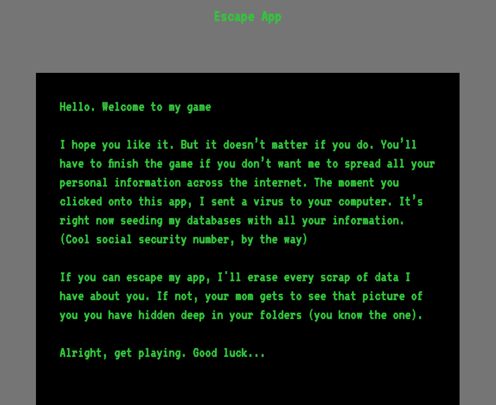

# Escape-App

 

  

  

<!-- ABOUT THE PROJECT -->
## About The Project

    Escape App is a text style game that is played within a browser page. The user navigates around a home using button prompts to find what item(s) they need to escape.

 

    

(<a href="#top">back to top</a>)

### Built With

* [HTML]
* [CSS]
* [JS]
* [Node.js]
* [Express]
* [MySQL]
* [Handlebars]
* [Bcrypt]
* [Animate.css]

(<a href="#top">back to top</a>)

<!-- GETTING STARTED -->

## Members

* Ryan Schubert
* MJ Shelton
* Angel Escobar

 

## Project Name: 
* [Github Repo](https://github.com/Eat-The-Bagel)
* [Wireframe](https://whimsical.com/proj-2-choose-your-own-adventure-7FoC6ZSoVSHfCs2mj4w7xa)
* [Member Agreement](https://docs.google.com/document/d/12b29oyukpLGLl2Rmx7p4xO4BmBqbYcyVtnf-yGQieec/edit?usp=sharing)
* [Presentation](https://docs.google.com/presentation/d/1IqZ8o7U2gX-CDu6EpM1lkO7HVobiCxDOYlqr4cVfQ18/edit?usp=sharing)
* [Escape App Website](https://eat-the-bagel.herokuapp.com/)
 
 

      

 

## Team Rules:

  * Support Each Other
  * Communicate at all times
  * Pitch idea before applying
  * Celebrate the successes
  * Laugh and have fun
  * Learn from each other 
  * Ask questions 
  * Don’t say sorry. 
  * Talk out all conflicts
  * Best ⅔ vote
  * Be honest

 

## Future Development:

 * Able to drop Inventory Items
 * Leaderboard
 * Unlocking new rooms using items in Inventory
 * Combining items in inventory
 * Adding Music

(<a href="#top">back to top</a>)

## Contact

Project Team: [https://github.com/Eat-The-Bagel](https://github.com/Eat-The-Bagel)

* Ryan Schubert - https://github.com/RyanSchu
* MJ Shelton - https://github.com/mjshelton12 
* Angel Escobar  - https://github.com/aescobar73 

(<a href="#top">back to top</a>)

<!-- ACKNOWLEDGMENTS -->
## Acknowledgments

* [NPM Animate](https://www.npmjs.com/package/animate.css)

(<a href="#top">back to top</a>)

